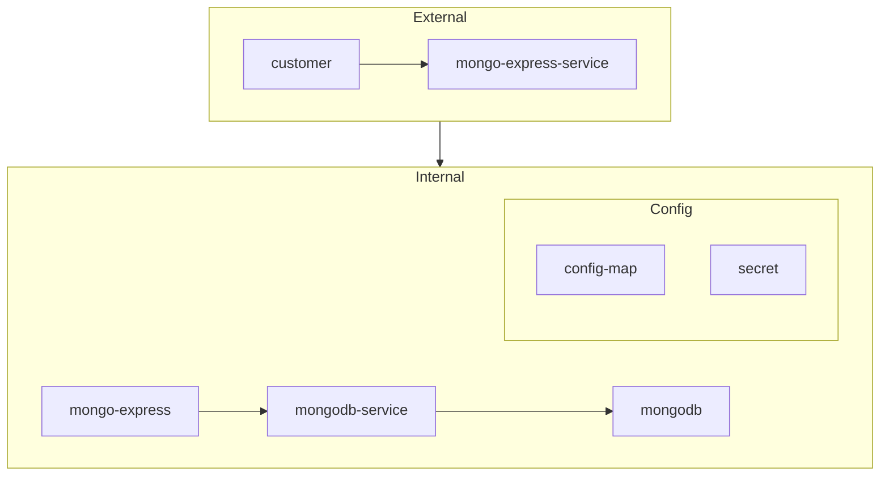

# Kubernetes Practice

```mermaid
flowchart TB;
    subgraph External
        direction LR
        customer --> mongo-express-service
    end
    subgraph Internal
        direction LR
        mongo-express --> mongodb-service
        mongodb-service --> mongodb
        subgraph Config
            config-map
            secret
        end
    end
    External --> Internal
```
