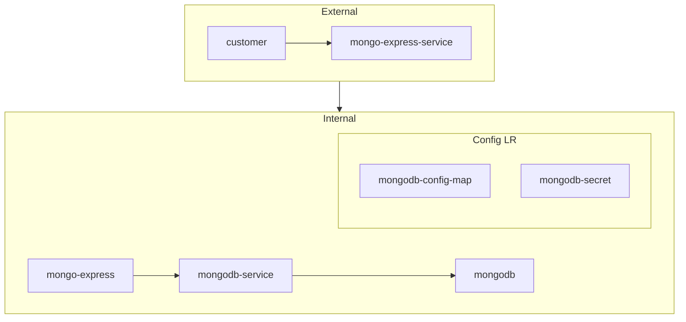

# Kubernetes Practice

This project is a demo project for Kubernetes learning.


```mermaid
flowchart TB;
    subgraph External
        direction LR
        customer --> mongo-express-service
    end
    subgraph Internal
        direction LR
        mongo-express --> mongodb-service
        mongodb-service --> mongodb
        subgraph Config LR
            mongodb-config-map
            mongodb-secret
        end
    end
    External --> Internal
```

```js
const hello = () => {
  return "hello world!";
};
```
